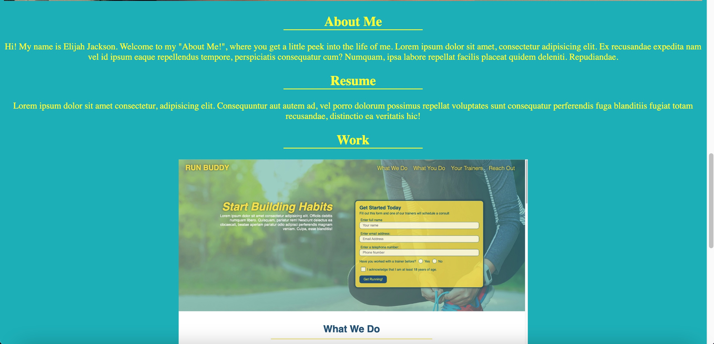
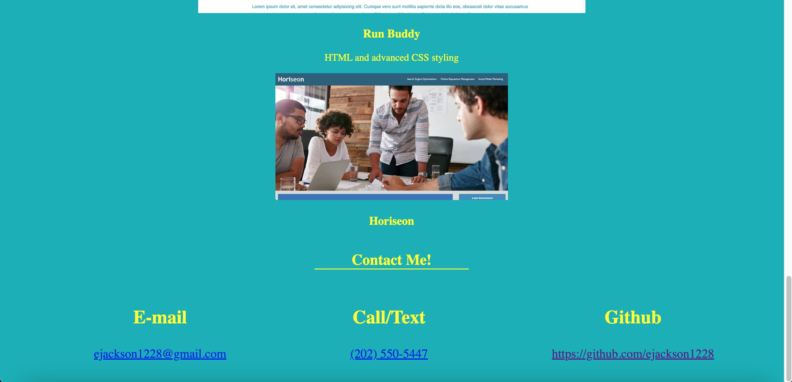

# Long-Yikes
Personal Portfolio

Description: In these files, you will find code for my personal portfolio page. the code involves:

- My name, a recent photo, and links to sections about me, my work, and how to contact me.
- A section for navigating the page, in the header.
- Titled images of my applications (the first being larger than the others.)
- A deployable application through the titled images. 
- Media Queries to adapt to different sized screens. 
<html>

</html>